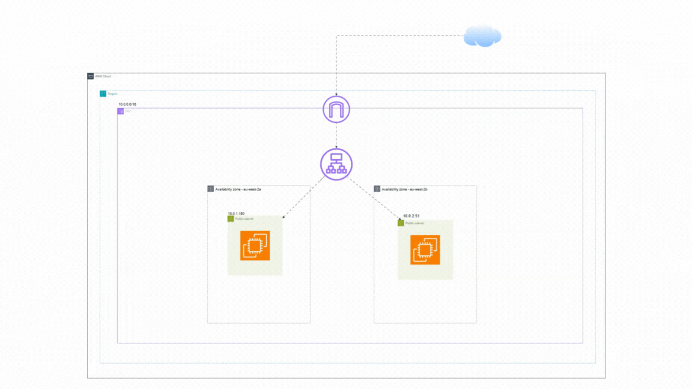

# Application Load Balancer (ALB)

## 🎯 Objective
Deploy an ALB with two EC2 instances behind it. Configure secure access so only the ALB can reach the EC2s.

---

## 🏗️ Architecture
- VPC (10.0.0.0/16)
- 2 public subnets in different AZs
- Application Load Balancer (ALB)
- 2 EC2 instances with Apache via user data
- Target Group with HTTP health checks

---

## 🔒 Security
- ALB-SG: HTTP (80) from 0.0.0.0/0
- EC2-SG: HTTP (80) from ALB-SG only
- No direct SSH access — setup automated via user data

---

## ✅ Verification
- ALB Target Group: both instances **Healthy**
- ALB DNS alternates between both web servers

---

## 🧹 Cleanup
Delete ALB → Target Group → EC2s → SGs → VPC

---

## 🖼️ Architecture Diagram

